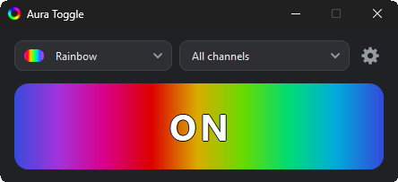
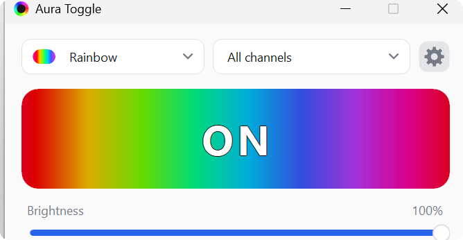

<div align="center">

# 💡 Aura Toggle

**Mainboard-Beleuchtung aus. Ohne Armoury Crate.**

Eine Datei mit ~740 KB · keine Installation · kein Hintergrunddienst · nichts wird ins Board geschrieben

[Download](#-download) · [Kommandozeile](#-kommandozeile) · [Effekte](#-effekte) · [Ist das sicher?](#-ist-das-sicher-für-mein-mainboard) · [English](README.md)



</div>

---

## 🌙 Das Problem

RGB-Beleuchtung auf einem Mainboard ist meist Alles-oder-nichts: Entweder läuft der Effekt, den
das BIOS zuletzt gesetzt hat, oder der, den die Hersteller-Software zuletzt gesetzt hat. Sie für
eine Weile abzuschalten — ein dunkler Raum nachts, ein langes Rendering, eine Phase ohne die
Lichtshow — bedeutet normalerweise einen von zwei Wegen:

| Weg | Was er kostet |
|---|---|
| Armoury Crate | Hintergrunddienst, Autostart, Konto, Updater, hunderte MB |
| BIOS | Neustart zum Ausschalten, noch ein Neustart zum Einschalten |
| **Aura Toggle** | Ein Klick. Datei löschen, wenn sie nicht mehr gebraucht wird |

Aura Toggle gibt es für den Fall, dass keiner dieser Wege den Aufwand für einen einzelnen
Schalter wert ist.

## ✨ Was es kann

- 🔌 Schaltet **alle** Kanäle: Onboard-Zone, 12-V-RGB-Header, jeden adressierbaren ARGB-Header
- 🎯 Oder **einzelne Kanäle** — Onboard-Zone statisch weiß, während ein ARGB-Header rot atmet
- 🎨 Neun eingebaute Effekte mit Farbwahl, sofort wirksam
- 🔆 **Helligkeit** für die Farbeffekte, 10 – 100 %, pro Kanal oder für das ganze Board
- 🧩 **Eigene Presets** — Name, ein Effekt und eine Farbe pro Kanal, gespeichert und wiederverwendbar
- 🖥️ Ein Fenster: ein Knopf, der den **laufenden Effekt animiert** und ihn umschaltet
- 📌 Lebt im Infobereich, Rechtsklick für An/Aus
- ⌨️ Vollständige Kommandozeile mit Exit-Codes — Aufgabenplanung, Skripte, Verknüpfungen
- 🔒 Keine Adminrechte, kein Treiber, kein Netzwerk, keine Telemetrie
- 🇩🇪 🇬🇧 Deutsch und Englisch, unabhängig von Windows umschaltbar

## 📥 Download

| | Größe | Braucht |
|---|---|---|
| **Portable** `Aura Toggle.exe` | ~740 KB | [.NET 10 Desktop Runtime](https://dotnet.microsoft.com/download/dotnet/10.0) |
| **Installer** (x64 und ARM64 in einer Datei) | ~2,5 MB | Nichts — er holt die Runtime bei Bedarf |

Portable: herunterladen, doppelklicken, fertig. Installer: für alle oder nur für dich, optional
Autostart und Desktop-Verknüpfung, restlose Deinstallation. Fehlt die .NET 10 Desktop Runtime,
fragt er einmal, lädt sie bei Microsoft herunter und installiert sie — statt 60 MB Runtime in
jedem Download mitzuschleppen.

## 🚀 Bedienung



1. **Großer Knopf** — zeigt den Zustand und schaltet ihn. Solange die Beleuchtung an ist,
   animiert er den laufenden Effekt, Helligkeit inklusive.
2. **Auswahlliste** — eingebauten Effekt oder gespeichertes eigenes Preset wählen, wird sofort
   gesetzt. Die letzte Zeile legt ein Preset an; jedes eigene Preset hat ein ✏️ zum Bearbeiten
   und ein ✕ zum Löschen, das noch einmal nachfragt.
3. **Kanal-Auswahl** — alle Kanäle oder ein einzelner: die Onboard-Zone, ein ARGB-Header oder
   ein ganzer Controller, wenn das Board mehrere hat. Beim Überfahren eines Kanals erscheint ein
   ✏️ zum Umbenennen.
4. **Farbfelder** — erscheinen bei Effekten mit Farbe, inklusive eigenem Farbwähler.
5. **Helligkeit** — erscheint zusammen mit den Farbfeldern, 10 bis 100 %, und folgt der
   Kanalauswahl: einen Header allein dimmen oder das ganze Board setzen, was jeden Kanal wieder
   dem boardweiten Wert überlässt.
6. **⚙️ Zahnrad** — Autostart, minimiert starten, beim Schließen minimieren, Beleuchtung beim
   Start, Animation an/aus, Sprache.

Minimieren schickt das Fenster in den Infobereich. Rechtsklick auf das Symbol schaltet um,
öffnet oder beendet.

### Eigene Presets

Ein eigenes Preset bündelt einen Effekt und eine Farbe **pro Kanal** unter einem selbst
gewählten Namen — die Onboard-Zone statisch weiß, während ein ARGB-Header rot atmet. Anlegen
über die letzte Zeile der Effektliste: benennen, dann pro Kanal Effekt und Farbe wählen,
speichern. Jeder Kanal startet mit dem, was gerade läuft, ein Preset für den aktuellen Look
braucht also keine einzige Änderung. Danach erscheint es in der Effektliste neben einem kleinen
Personen-Symbol, auf einen Blick von den eingebauten Effekten unterscheidbar. Jeder Kanal hat
dort auch seine eigene Helligkeit, ein Preset kann also einen Header auf 30 % und den nächsten
auf voller Helligkeit halten. Das Fenster hat keine eigene Titelleiste, lässt sich aber an seiner
Überschrift verschieben und steht damit nie im Weg.

## ⌨️ Kommandozeile

```bat
"Aura Toggle.exe"                            :: öffnet das Fenster
"Aura Toggle.exe" -off                       :: Beleuchtung aus
"Aura Toggle.exe" -on                        :: zurück auf den letzten Effekt
"Aura Toggle.exe" -preset rainbow            :: Effekt wechseln
"Aura Toggle.exe" -preset static "#20C0FF"   :: Effekt mit Farbe
"Aura Toggle.exe" -brightness 40             :: Farbeffekte dimmen, 10 bis 100
```

`-on`, `--on`, `/on`, `on` — alles erlaubt, Groß-/Kleinschreibung egal. Ebenso bei `off`,
`preset` und `brightness`. Eigene Presets und einzelne Kanäle sind nur im Fenster erreichbar:
ein Preset ist ein Bündel aus Kanälen und kein einzelner Effekt mit Farbe, und ein Kanal bedeutet
ohne den Controller, zu dem er gehört, nichts.

**Exit-Codes:** `0` ok · `2` falsches Argument · `3` kein Controller · `4` Controller belegt ·
`5` Kommunikationsfehler. Fehler gehen nach stderr.

> ⚠️ **PowerShell** wartet nicht auf Fensteranwendungen. Für den Exit-Code:
> `Start-Process "Aura Toggle.exe" -ArgumentList "-off" -Wait -NoNewWindow`.

**Nachts automatisch aus:**

```bat
schtasks /create /tn "LEDs aus" /tr "\"C:\tools\Aura Toggle.exe\" -off" /sc daily /st 23:30
schtasks /create /tn "LEDs an"  /tr "\"C:\tools\Aura Toggle.exe\" -on"  /sc daily /st 08:00
```

Neben der Exe liegen zwei fertige Verknüpfungen, **Aura An** und **Aura Aus**. Sie enthalten
einen relativen Pfad, der Ordner lässt sich also beliebig verschieben.

## 🎨 Effekte

| Name | Sieht aus wie | Farbe |
|---|---|---|
| `static` | Eine feste Farbe | ✅ |
| `breathing` | Auf- und abblenden | ✅ |
| `flashing` | Blinken | ✅ |
| `spectrum-cycle` | Alle LEDs durchlaufen gemeinsam das Spektrum | — |
| `rainbow` | Verlauf, der über die LEDs wandert *(ASUS-Standard)* | — |
| `rainbow-breathing` | Farbwechsel mit Blenden | — |
| `chase-fade` | Lauflicht mit ausblendendem Schweif | ✅ |
| `chase` | Lauflicht | ✅ |
| `wave` | Langsam driftendes Spektrum über den Strip | — |

Namen werden großzügig erkannt: Groß-/Kleinschreibung, Leerzeichen, Binde- und Unterstriche
sind egal, die übersetzten Namen funktionieren ebenfalls. Ein unbekannter Name gibt die Liste
aus.

> Es gibt **keine Geschwindigkeit und keine Richtung**. Der Controller kennt das nicht — sein
> Effektbefehl trägt einen Kanal und einen Modus, sonst nichts.
>
> **Helligkeit** entsteht dadurch, dass die gesendete Farbe skaliert wird, gilt also für die
> fünf oben mit ✅ markierten Effekte. Die anderen vier erzeugt die Firmware des Controllers
> selbst; sie nimmt weder Farbe noch Helligkeit an — dimmen lässt sich dort nichts.
>
> Effekte lassen sich über die Kanäle **mischen** — ein Header statisch rot, der nächste atmend —
> aber nur die fünf Farbeffekte. Die anderen vier sind ein Effekt-Generator im Controller, den
> alle seine Kanäle teilen: setzt man den Regenbogen auf einen Header, läuft er auf allen Headern
> dieses Controllers. Deshalb bietet das Fenster bei ausgewähltem Einzelkanal nur die fünf an und
> sagt das auch, statt die Wahl still auf die Nachbarn auszudehnen.

## 🔒 Ist das sicher für mein Mainboard?

**Ja**, und der Grund ist wichtig.

Der Aura-Controller hält seine Konfiguration im eigenen Flash, und dieser Flash ist das, was
dein Board beim Einschalten anwendet. Aura Toggle sendet **nie den Befehl, der dort
hineinschreibt**. Nur flüchtige Effektbefehle, die im RAM des Controllers stehen.

- ✅ Deine BIOS-Beleuchtungseinstellungen bleiben unangetastet
- ✅ Nach einem Neustart ist die Beleuchtung wieder da, auch wenn du sie vorher ausgeschaltet hast
- ✅ Deinstallieren heißt: eine Datei löschen
- ✅ Kein Kerneltreiber, keine Adminrechte — es ist ein normales USB-HID-Gerät

## 💻 Voraussetzungen

- Windows 10 oder 11, 64 Bit oder ARM64
- Ein ASUS-Mainboard mit Aura-USB-Controller — ab X470-/Z390-Generation, inklusive aktueller
  AM5- und LGA1700-Boards

Entwickelt und geprüft auf einem **ROG STRIX Z790-E GAMING WIFI**. Der Controller wird im
Dialog mit dem Gerät erkannt, nicht über eine Modellliste — nicht aufgeführte ASUS-Boards
derselben Familie sollten also funktionieren.

## 🛠️ Wenn etwas klemmt

**„Kein AURA-LED-Controller gefunden"**
Kein Aura-USB-Controller auf dem Board, oder die Beleuchtung ist im BIOS aus. Im Geräte-Manager
unter „Eingabegeräte" nach der Hardware-ID `USB\VID_0B05` schauen.

**„Der AURA-LED-Controller wird von einem anderen Programm belegt"**
Armoury Crate, OpenRGB oder SignalRGB halten ihn offen. Beenden — zwei Programme können
denselben Controller nicht gleichzeitig steuern.

**Die Beleuchtung kommt anders zurück**
Der Controller kann nicht mitteilen, welcher Effekt läuft, das Tool merkt sich also, was es
zuletzt gesetzt hat. Beim allerersten Einschalten greift der ASUS-Regenbogen. Neustarten oder
einfach den gewünschten Effekt wählen.

## 🔨 Selbst bauen

Braucht das .NET 10 SDK. Für den Installer zusätzlich [Inno Setup 6](https://jrsoftware.org/isinfo.php).

```bat
build.bat             :: alles: Portable, Installer, dist\release fertig zum Hochladen
build.bat portable    :: nur dist\Aura Toggle.exe, x64
build.bat installer   :: nur das Setup für x64 und ARM64
```

Regressionssuite — sie schaltet währenddessen die Beleuchtung und lässt sie danach an:

```bat
powershell -ExecutionPolicy Bypass -File tests\aura-tests.ps1
```

## ⚙️ Wie es funktioniert

Der Controller ist ein USB-HID-Gerät. Aura Toggle zählt die HID-Schnittstellen auf, fragt jede
in Frage kommende nach Firmware-String und Konfigurationstabelle und behält die, die antworten
— deshalb ist keine Schnittstellennummer fest verdrahtet, und deshalb werden auf Boards mit
mehreren Controllern auch mehrere gefunden. Die Konfigurationstabelle liefert pro Controller die
Kanalaufteilung, ein Effektbefehl pro Kanal erledigt den Rest.

Die Befehle werden getaktet und die Sequenz zweimal gesendet: Der Controller verwirft
stillschweigend Befehle, die eintreffen, während er noch beschäftigt ist — sonst blieben die
ARGB-Header an, während die Onboard-Zone schon geschaltet hatte.

Der Zustand liegt unter `%LOCALAPPDATA%\aura-toggle` — `state.json` für den letzten Effekt und
die Helligkeit, `settings.json` für die Einstellungen, `presets.json` für eigene Presets,
`channel-state.json` für den letzten Stand jedes Kanals samt eigener Helligkeit,
`channel-names.json` für umbenannte
Kanäle. Portable und installierte Variante teilen sie sich, jeder Schreibvorgang läuft über eine
temporäre Datei, damit ein Abbruch keine Datei beschädigt, und die Deinstallation fragt, ob der
Ordner gelöscht werden soll.

## 📄 Lizenz und Marken

MIT, siehe [LICENSE](LICENSE). Die Software kommt **ohne jede Gewähr**, und niemand haftet
dafür, was sie auf deinem Rechner anstellt.

Dies ist ein unabhängiges Projekt. Es stammt **nicht** von ASUSTeK Computer Inc. und wird von
dort weder unterstützt noch empfohlen. „ASUS", „ROG", „TUF" und „Aura" sind Marken der
jeweiligen Inhaber und werden hier ausschließlich zur Beschreibung der angesprochenen Hardware
verwendet. Es wird keine ASUS-Software, kein Treiber und keine Bibliothek verwendet,
mitgeliefert oder vorausgesetzt.
