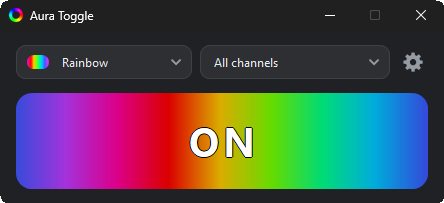
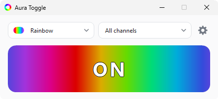

<div align="center">

# 💡 Aura Toggle

**Turn off ASUS RGB — without Armoury Crate.**

[](https://github.com/wbgcoding/Aura-Toggle/releases/latest)
[](LICENSE)

[Download](#-download) · [Command line](#-command-line) · [Effects](#-effects) ·
[Troubleshooting](#-troubleshooting) · [Privacy](#-privacy) · [Changelog](CHANGELOG.md)



</div>

---

| | Aura Toggle | Armoury Crate | OpenRGB / SignalRGB |
|---|---|---|---|
| Size | ~700 KB | Hundreds of MB | Tens of MB and up |
| Background service | None | Always running | Usually running |
| Device range | ASUS Aura mainboard lighting only | ASUS ecosystem | Many vendors, many device types |
| Effects | 9 built-in, plus your own presets | ASUS's own effect set | Large effect libraries, often per-LED |

OpenRGB and SignalRGB genuinely do more — more devices, more effects, per-LED control on
hardware that supports it. Aura Toggle needs no service and no background process — it does its job and gets out of the way.

**Quickstart:**

1. Download `AuraToggle.exe` below (or the installer)
2. Run it — no setup, no admin rights
3. Click the button

---

## 🌙 The problem

RGB lighting on a mainboard is usually all-or-nothing: it either runs whatever effect the BIOS
left it in, or it runs whatever the vendor's control suite last set. Turning it off for a while
— a dark room at night, a long render, a stretch without needing the show — normally means one
of two routes:

| Option | What it costs |
|---|---|
| Armoury Crate | Background service, auto-start, updater, hundreds of MB |
| BIOS | A reboot to switch off, another reboot to switch back on |
| **Aura Toggle** | One click. Delete the file when you no longer need it |

Aura Toggle exists for the case where none of that is worth it for flipping one switch.

## ✨ What it does

- 🔌 Switches **every** channel the board reports: the onboard zone and all addressable ARGB headers
- 🎯 Or **one channel at a time** — the onboard zone steady white while an ARGB header breathes red
- 🎨 Nine built-in effects with a colour picker, applied instantly
- 🔆 **Brightness** for the colour effects, 10–100%, per channel or for the whole board
- 🧩 **Custom presets** — a name, one effect and colour per channel, saved and reusable
- 🖥️ One window: a button that animates the running effect and switches it
- 📌 Lives in the notification area, left-click for on/off
- ⌨️ Full command line with exit codes — **Stream Deck**, scheduled tasks, scripts, shortcuts
- 🔥 A global hotkey, configurable, switches the whole board from anywhere
- 🏷️ **Name your channels** — "Desk strip" rather than "ARGB 1". While you pick a name, that one
  header lights up white and the rest of the board goes dark, so there is nothing to guess
- 🌍 **Ten languages** in the window *and* in the setup: English, German, Spanish, Portuguese,
  Italian, Dutch, Polish, Turkish, Japanese and Chinese
- 🔒 No admin rights, no driver, no telemetry. The program opens no network connection of its
  own; the only thing that ever does is the setup, and only to fetch the .NET runtime from
  Microsoft if your PC has none

## 🚫 What it can't do

- No individual LED control — an effect and colour apply to a whole channel, not one LED
- Only one dynamic effect per controller — spectrum cycle, rainbow, rainbow breathing and wave
  run across every channel of a controller at once, not one at a time
- Only mainboard lighting — no GPU, RAM, fans or other Aura Sync devices
- No channel of its own for a plain (non-addressable) 12 V RGB header — only what the board
  reports as its onboard zone is switched
- Can't read the current effect back from the controller — it remembers what it last set instead
- Doesn't survive a reboot on its own — see below for why, and what to do instead

**Why "off" doesn't stay off without the tool running:** writing a look into the controller
permanently means committing it to flash, and a write that goes wrong there can brick the
controller for good. This tool deliberately never does that — everything it sends is volatile, so
a restart always brings the BIOS lighting back, on purpose. If you want lighting that starts off
without this tool running, set autostart with "lighting at start: off" in the gear, or turn it off
in the BIOS itself.

## 📥 Download

**➡️ [Latest release](https://github.com/wbgcoding/Aura-Toggle/releases/latest)** — both files are
attached there, along with `SHA256SUMS.txt` to check them against.

| | Size | Needs |
|---|---|---|
| **Portable** `AuraToggle.exe` | ~700 KB | [.NET 10 Desktop Runtime](https://dotnet.microsoft.com/download/dotnet/10.0) |
| **Installer** `AuraToggle-Setup-<version>.exe` | ~2.3 MB | Nothing — it fetches the runtime if you lack it |

Portable: download, double-click, done. Installer: for everyone or just for you, optional
autostart and desktop shortcut, clean uninstall. If the .NET 10 Desktop Runtime is missing it
asks once, downloads it from Microsoft and installs it.

To check a download against `SHA256SUMS.txt` from the same release:

```powershell
Get-FileHash .\AuraToggle.exe -Algorithm SHA256
```

Compare the result against the matching line in `SHA256SUMS.txt`. Windows SmartScreen will warn
on the first run either way, since the file is not code-signed — "More info" then "Run anyway"
gets past it.

**Does this fit my board?** Grab the portable exe and run `AuraToggle.exe -list`; if it names a
controller, it works.

**Unattended installs** — verified switches, for scripted rollouts:

```bat
AuraToggle-Setup-<version>.exe /VERYSILENT /NORESTART        :: for everyone, no prompts
AuraToggle-Setup-<version>.exe /VERYSILENT /CURRENTUSER      :: just the current user
AuraToggle-Setup-<version>.exe /VERYSILENT /LOG="install.log" :: with a log file
AuraToggle-Setup-<version>.exe /LANG=ja                      :: force the setup language
unins000.exe /VERYSILENT                                     :: silent uninstall
```

The setup speaks the same ten languages as the program and picks the one Windows is set to, so it
never opens with a language question in front of the wizard. `/LANG=` overrides that with any of
`en de es pt it nl pl tr ja zh`.

## 🚀 Using it



1. **Big button** — shows the state and switches it. While the lighting is on it animates
   whatever effect is running, brightness included.
2. **Drop down** — pick a built-in effect or a saved custom preset; it applies immediately. Hover
   a built-in effect for a one-line explanation of what it does. The last row creates a preset;
   each preset of your own carries icons to duplicate it, edit it, or delete it (which asks once
   more before it does) — F2 and Delete do the edit and delete from the keyboard.
3. **Channel selector** — all channels, or a single one: the onboard zone, one ARGB header, or
   one whole controller on boards that have several. Hover a channel for a ✏️ to give it a name
   of your own — while the name box is open that header is lit white and every other channel on
   the board is taken dark, which is the quickest way to find out which header is which.
4. **Colour chips** — appear for effects that use a colour, including a custom colour picker.
5. **Brightness** — appears with the chips, 10 to 100%, and follows the channel selector: dim
   one header on its own, or set the whole board at once, which hands every channel back to the
   board-wide value. The big button dims along while you drag, so the setting can be judged
   before it is committed. Effects the controller generates itself cannot be dimmed, so the
   slider is not shown for those rather than sitting there doing nothing.
6. **⚙️ Gear** — minimise instead of close, always on top, animate switch, a global hotkey,
   autostart, lighting at start, language, reset everything back to first-run defaults -
   including your own custom presets - after first zipping every file it is about to delete into
   `reset-backup.zip`, right next to them.

Minimising sends the window to the notification area. Left click the icon there to toggle the
lighting, double-click to reopen the window, right-click for the same options in a menu.

The window reopens where and how wide you last left it — unless that spot belongs to a display
that is no longer attached, in which case it centres itself rather than opening off-screen.

### Custom presets

A custom preset bundles one effect and colour **per channel** under a name of your own — the
onboard zone steady white while an ARGB header breathes red, say. Create one from the last row
of the effect drop down: name it, then an effect and colour per channel, save. Every channel
starts out matching whatever is running right now, so a preset that should just save the
current look needs no changes at all. It then shows up in the effect list next to a small
person icon, told apart from the built-in effects at a glance. Each channel also carries its own
brightness there, so a preset can hold one header at 30% and the next at full. The editor has no
title bar of its own but can be dragged by its heading, so it never sits in the way.

Export and Import in the editor move a preset as a single `.json` file — to another machine, a
second Windows profile, or just a backup. On different hardware the channels are matched by their
position (first channel to first channel, and so on) rather than the exact controller, since a
different machine has no way to have the same one. Import takes the file as it finds it: anything
larger than 256 KB is refused outright, and a name longer than the 40 characters the editor allows
is shortened to fit.

## ⌨️ Command line

```bat
AuraToggle.exe                            :: opens the window
AuraToggle.exe -off                       :: lighting off
AuraToggle.exe -on                        :: back to the last effect
AuraToggle.exe -toggle                    :: on if it's off, off if it's on
AuraToggle.exe -preset rainbow            :: switch to an effect
AuraToggle.exe -preset static "#20C0FF"   :: effect with a colour
AuraToggle.exe -brightness 40             :: dim the colour effects, 10 to 100
AuraToggle.exe -custom "Movie Night"      :: apply a preset saved in the window
AuraToggle.exe -custom 1                  :: or by its number from -list
AuraToggle.exe -list                      :: number every controller, channel and preset
AuraToggle.exe -status                    :: current effect, colour, brightness, on/off
AuraToggle.exe -status --json             :: the same, as one line of JSON for scripts
AuraToggle.exe --version                  :: version number, nothing else
AuraToggle.exe -help                      :: every command, explained
```

`-on`, `--on`, `/on`, `on` — all accepted, any casing. Same for `off`, `toggle`, `preset`,
`brightness`, `custom`, `list`, `status`, `version` and `help` (also `-h` and `/?`). Creating a
custom preset still only happens in the window - applying an existing one does not.

**One channel or controller**, with `-on`, `-off`, `-toggle`, `-preset` and `-brightness`:

```bat
AuraToggle.exe -preset static red -channel 2       :: by the number from -list
AuraToggle.exe -preset static red -channel 1.2     :: controller 1, channel 2
AuraToggle.exe -preset static red -channel "ARGB 1" :: by its default or renamed name
AuraToggle.exe -on -device 1                       :: every channel of controller 1
AuraToggle.exe -toggle -channel 2                  :: only that channel's own on/off state
```

`-channel` accepts a flat number from `-list`, the `<controller>.<channel>` form, the default
name in any of the ten interface languages, or a name given in the window - matched the same
forgiving way as preset names (casing, spaces and hyphens ignored). An unknown or ambiguous target exits
`2` and lists the possible targets on stderr. `-list` and `-status` are always in English, regardless of the window's
language, so a script reading them does not break when someone switches it; error messages stay
translated.

**Exit codes:** `0` ok · `2` bad argument · `3` no controller · `4` controller busy ·
`5` communication error. Errors go to stderr.

> ⚠️ **PowerShell** does not wait for windowed apps. For the exit code use
> `Start-Process AuraToggle.exe -ArgumentList "-off" -Wait -NoNewWindow`.

**Lights out at night, automatically:**

```bat
schtasks /create /tn "LEDs off" /tr "C:\tools\AuraToggle.exe -off" /sc daily /st 23:30
schtasks /create /tn "LEDs on"  /tr "C:\tools\AuraToggle.exe -on"  /sc daily /st 08:00
```

**Stream Deck and other macro software:** every command above is a plain program call that ends
on its own, so anything able to start a program can drive the lighting — no plugin, no background
service, no window flashing up. On a Stream Deck, add a **System → Open** button and give it the
exe plus its arguments:

```bat
C:\tools\AuraToggle.exe -toggle                :: one key that switches the board
C:\tools\AuraToggle.exe -custom "Movie Night"  :: one key per scene
C:\tools\AuraToggle.exe -preset static red -channel 2   :: one key for one header
C:\tools\AuraToggle.exe -brightness 40         :: dim it for the evening
```

A Multi Action chains several of them into one key, and the same calls work from AutoHotkey,
Voicemeeter macro buttons, a game launcher's pre/post-launch command, Home Assistant, or a `.bat`
on the desktop. `-status --json` reads the current state back if the macro needs to know it.

## 🎨 Effects

| Name | Looks like | Colour |
|---|---|---|
| `static` | One steady colour | ✅ |
| `breathing` | Fades in and out | ✅ |
| `flashing` | Blinks | ✅ |
| `spectrum-cycle` | All LEDs cycle the spectrum together | — |
| `rainbow` | Gradient travelling across the LEDs *(ASUS default)* | — |
| `rainbow-breathing` | Spectrum cycle that fades | — |
| `chase-fade` | Running light with a fading tail | ✅ |
| `chase` | Running light | ✅ |
| `wave` | Slow spectrum drifting across the strip | — |

Names are forgiving: casing, spaces, hyphens and underscores are ignored, and the translated
names work too. An unknown name prints the list.

> **Brightness** works by scaling the colour that is sent, so it applies to the five effects
> marked ✅ above. The other four are generated inside the controller's own firmware, which
> takes no colour and no brightness — nothing can dim those short of switching them off, and
> the window hides the slider while one of them is running.
>
> Effects can be **mixed** across channels — one header steady red while the next one breathes —
> but only for the five colour effects. The other four are one effect engine inside the
> controller, shared by all of its channels: set the rainbow on a single header and every header
> of that controller runs it. The window still offers all nine with a single channel selected, but
> flags it with a hint rather than letting the choice quietly spread.

## 💻 Requirements

- Windows 10 or 11, 64 bit
- An ASUS mainboard with an onboard Aura USB controller (most ASUS boards with Aura Sync or
  addressable RGB headers have one, going back several chipset generations)

Developed and verified on an **ASUS Z790 mainboard**. The controller is found by talking to it
directly, not by a model list, so it either works or reports no controller found — see
[Troubleshooting](#-troubleshooting).

## 🛠️ Troubleshooting

**"No AURA LED controller found"**
No Aura USB controller on the board, or lighting is off in the BIOS.

**"The AURA LED controller is in use by another program"**
Armoury Crate, OpenRGB or SignalRGB holds it open. Close them — two programs cannot drive the
same controller.

**The lighting comes back looking different**
The controller cannot report which effect is running, so the tool remembers what it set last.
On the very first switch-on it falls back to the ASUS rainbow. Reboot, or just pick the effect
you want.

**Still stuck — where the log is**
Start-up, version and every error land in a plain text file:

```
%LOCALAPPDATA%\aura-toggle\log.txt
```

Paste that path into the Explorer address bar or into Win+R. It rolls over to `log.old.txt` past
200 KB, holds no personal data — your user name is replaced with `%USERPROFILE%` — and the last
few lines are usually enough to say why a controller could not be reached. Attach them to a bug
report.

## 🔨 Building

Needs the .NET 10 SDK. The installer additionally needs
[Inno Setup 6](https://jrsoftware.org/isinfo.php).

`build.bat` at the root of the repository is the whole build. Run it with no argument, or double
click it, and it produces everything a release consists of:

```bat
build.bat                REM everything: portable exe, installer, checksums
build.bat portable       REM only the portable x64 exe and its two shortcuts
build.bat installer      REM only the setup
```

A full build empties `dist\` first, so what is left there afterwards is exactly the release:
`AuraToggle.exe`, the `Aura On` / `Aura Off` shortcuts, `AuraToggle-Setup-<version>.exe` and
`SHA256SUMS.txt`. A single-target run adds to `dist\` instead of clearing it, so a portable build
does not throw away the setup a full build made. The
version comes from the project file, not from anything typed twice. Set `NOPAUSE=1` to run it
from a script without the closing keypress.

The single command behind the portable build, if you would rather not use the script:

```powershell
dotnet publish AuraToggle.csproj -c Release -r win-x64 --self-contained false -p:PublishSingleFile=true -o dist
```

For the Inno Setup installer, pack `installer\aura.iss` with `ISCC.exe` (needs
[Inno Setup 6](https://jrsoftware.org/isinfo.php)).

Regression suite — it switches the lighting while it runs and leaves it on afterwards:

```bat
powershell -ExecutionPolicy Bypass -File tests\aura-tests.ps1
```

Static checks — no controller needed, they only read the source tree. Resource keys in step across
all ten languages, placeholders included, no hardcoded interface text, no fixed pixel sizes that
skip the display scaling, one version across project, installer and changelog:

```bat
powershell -ExecutionPolicy Bypass -File tests\static-checks.ps1
```

## ⚙️ How it works

The controller is a USB HID device. Aura Toggle enumerates the HID interfaces, asks each
candidate for its firmware string and configuration table, and keeps the ones that answer —
which is why no interface number is hardcoded, and why more than one controller is found on
boards that have them. The configuration table gives each controller's channel layout; one
effect command per channel does the rest.

Commands are paced and the sequence is sent twice: the controller silently drops commands that
arrive while it is still busy, which otherwise left the ARGB headers running after the onboard
zone had already switched.

## 🔒 Privacy

No account, no telemetry, no analytics, no advertising, nothing profiled and nothing shared. The
tool has no server of its own to send anything to.

State lives in `%LOCALAPPDATA%\aura-toggle`:

- `state.json` — the last effect and brightness
- `settings.json` — your preferences
- `presets.json` — custom presets
- `channel-state.json` — what each channel was last set to, including its own brightness
- `channel-names.json` — channels you renamed
- `log.txt` (rotated to `log.old.txt` past 200 KB) — start-up, version and error entries
- `reset-backup.zip` — written only when you reset everything in the gear, holding copies of the
  files that reset is about to delete, so nothing is lost by accident. Delete it whenever you
  like; nothing reads it

The per-channel files are keyed by the controller's device path, so the entries
survive a reboot. Portable and installed builds share the folder, every write goes through a
temporary file so an interrupted save cannot corrupt one, and uninstalling offers to delete it.
Nothing in there is ever sent anywhere, and your user name is replaced with `%USERPROFILE%` in
anything the log or the error dialog writes out.

## 📄 Licence and trademarks

[MIT](LICENSE): free to use privately or commercially, pass on and change, no strings attached
beyond keeping the copyright notice with it. The software comes **without any warranty**, and
nobody is liable for what it does on your machine.

This is an independent project. It is **not** made, endorsed or supported by ASUSTeK Computer
Inc. "ASUS", "ROG", "TUF" and "Aura" are trademarks of their respective owners, used here only
to describe which hardware this talks to. No ASUS software, driver or library is used, bundled
or required.
